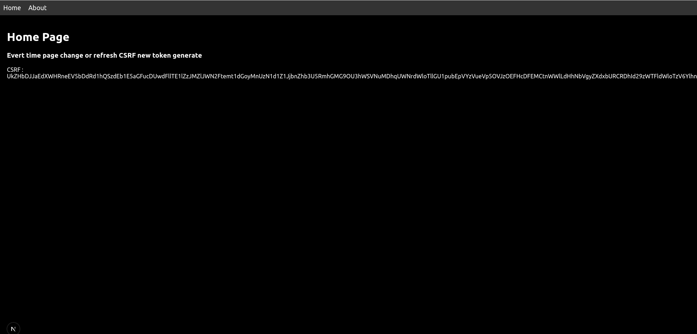
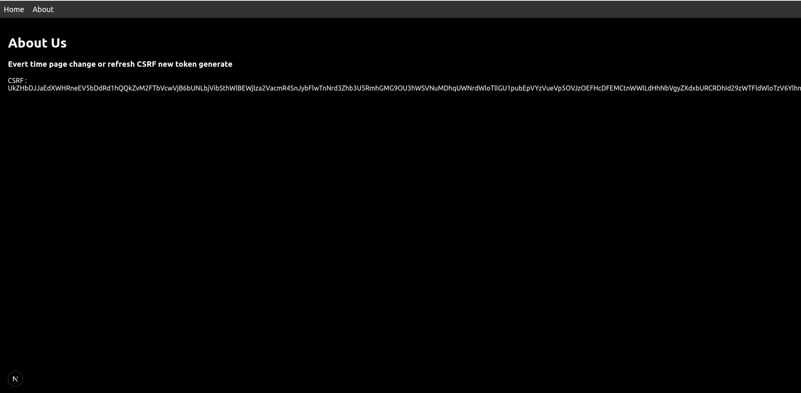

# Next.js Project

Welcome to the Next.js project! This project serves as a web application built with Next.js.

## Table of Contents

- [Getting Started](#getting-started)
- [Features](#features)
- [Setup](#setup)
- [Usage](#usage)
- [Image Attachment](#image-attachment)
- [License](#license)

## Getting Started

To get started with the project, follow the steps below:

## Features

- [x] Server-side rendering (SSR)
- [x] Dynamic routing
- [x] Middleware integration for CSRF token management
- [x] Set CSRF token in cookies
- [x] Get CSRF token from cookies

## Setup

1. Clone the repository:
   ```bash
   git clone https://github.com/peyas4854/next-js-experiment-12.git
2. Change into the project directory:
   ```bash
   cd next-js-experiment-12
3. Install the dependencies:
   ```bash
    npm install
4. Start the development server:

    ```bash
    npm run dev
    ```
5. Open the browser and navigate to `http://localhost:3000`.

## Usage

Once the server is running, open your browser and visit http://localhost:3000 to see the application in action. You can
explore the pages and see SSR behavior, including how CSRF tokens are handled.

## Image Attachment

- 

- 

## License

This project is licensed under the MIT License - see the [LICENSE](LICENSE) file for details.

